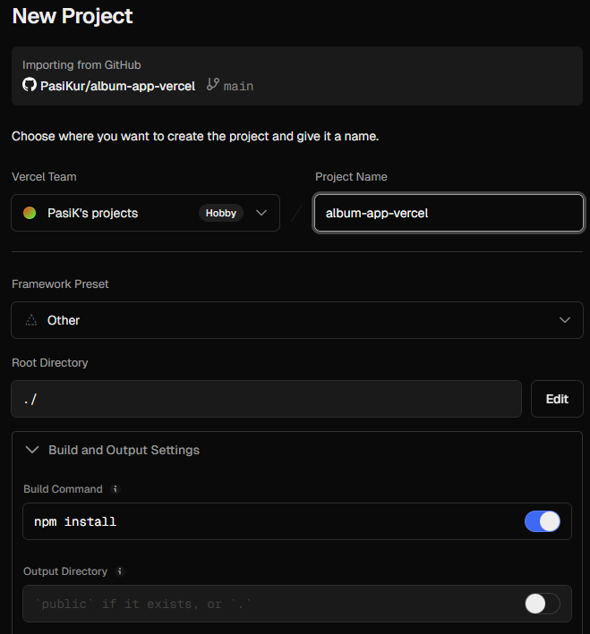

# Exercise set 08

...continue from E08/Task1-3 (found in GitLab)...

## 4. Deploying the application

I decided to use **Vercel** as the hosting platform for deploying the album abb collection to the cloud.

### a) Setting up the app for deployment

In Vercel, the Express API:s work as functions. So we create one serverless function which then runs every time someone makes an request to our API.

In order to get our app to run in Vercel, we will need a **vercel.json** file in the root the project. This file will tell Vercel:

- the entry point (app.js)
- routing the requests to the app

```js
{
  "version": 2,
  "builds": [
    {
      "src": "app.js",  // program file of the app (serverless function to be run)
      "use": "@vercel/node"  // runs with node
    }
  ],
  "routes": [
    {
      "src": "/(.*)",  // all routes, matches with all requests
      "dest": "app.js"  // forward all requests to our app (has own routers)
    }
  ]
}
```

After this we must remember to install Vercel globally from CLI:

```bash
npm i -g vercel
```

We also add a new script for deployment to package.json. So we separate it from 'regular' start because Vercel expects the app to be a single function file (app.js).

```js
// used by Vercel deployment (app.js is the entry point for serverless functions)
"start:": "node app.js",
```

### b) Pushing project to GitHub (instead of GitLab...)

I first planned to deploy album app from GitLab using a CI/CD pipeline. After a long struggle with access permissions, CI/CD settings and failing pipeline runs, I made the decision to switch to using GitHub. Since my role status in my GitLab repo is Developer (not Owner or Maintainer), I had no access rights to **Settings -> CI/CD** (required e.g. to add secrets of trigger deployments from GitLab).

But the work was not useless, I learned new things as well.

Next I created a new repository to my GitHub account called **album-app-vercel** and cloned it to my local computer. Then I made a copy of 'E08/Task1-4' and moved all folders/files under the **album-app-vercel** folder.  
Finally I pushed the contents of **album-app-vercel/...** back to GitHub repo which now includes all needed folders and files for the depoyment of E08 exercise set / Task4.

Next step is to log in to Vercel and link GitHub repo for deployment.

### c) Logging in to Vercel and creating a new project

Now we log in to Vercel with browser: **https://vercel.com/dashboard**

There we choose: **'Add new -> Project'**


And **album-app-vercel** repository can now be selected when installing Vercel.


A **New Project** form opens up and requires to fill in following info:
- Framework Preset -> **Other**
- Build Command -> **npm install**
- Output directory -> **leave empty**



Last thing needed for setup is environmental values, which will be added as key-value pairs. Needed values are:
- MONGODB_URI (connection string to database)
- SESSION_SECRET (secret key for encryption and cookies)

TEST_MONGODB_URI is not used in deployment, because now we are running the actual app, not for testing purposes.


To complete the deployment -> **Deploy** button was clicked.

### d) Disabling middleware 'authUser' temporarily for deployment

The **authUser** middleware was used for protecting the route **/api/albums**.
Because Vercel production environment is serverless, this session-based authentication did not work correctly.

So I decided to temporarily remove **authUser** from route **GET/api/albums** in **routes/albums.js**.

```js
// modified for deployment testing (authentication skipped)
router.get('/', getAllAlbums)
```

After this, testing the route Vercel deployment was successful in browser:


### Summary

Even though I couldn't manage to complete the exercise with using GitLab CI/CD pipeline features, these functionalities were still reached:

- Vercel deployment -> ok
- route **api/albums** accessible (with authUser disabled...) -> ok
- configurations and environment variables set up correctly -> ok
- GitHub repo created with all project files as source code -> ok

App: https://album-app-vercel.vercel.app/api/albums  
GitHub repository: (https://github.com/PasiKur/album-app-vercel)

Task4 finally finished.
